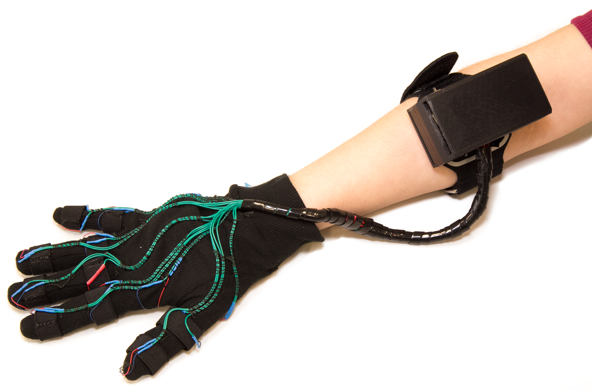

# HapGloves
<b>Vibrotactile Gloves for 3D Interaction</b>

The HapGloves are a pair of gloves for 3D interaction. They rely on hand tracking (i.e., Leap Motion) to provide vibrotactile feedback on fingers and palm surface. The device contains 14 LRA actuators (PMC10-100)[1] for each hand, driven independently with PWM signals and managed wirelessly from the computer using Bluetooth Low Energy technology. 
All the electronics and power sources are enclosed in a fore-arm band, offering freedom of movement and comfort for common hand-interaction tasks in VR environments.
The actuators are controlled by an Adafruit 16-channel 12-bit pulse width modulation (PWM) driver[2]. A self-made circuit board organizes the connections, provides signal enhancements (including amplifying, basic active breaking, and basic overdriving), and fits directly onto the PWM driver. 
Each glove is powered by a 3.7V lithium polymer ion (LiPo) rechargeable battery. 
To mount the circuitry around the arm, all the components are installed in a 3D-printed case, which can be attached to a neoprene arm belt.

This repository contains the necessary files to build a new device; model files for 3D printing, schematics for electronics, and embedded/testing code.

Inducing Body-Transfer Illusions in VR by Providing Brief Phases of Visual-Tactile Stimulation 
Oscar Ariza, Jann Freiwald, Nadine Laage, Michaela Feist, Mariam Salloum, Gerd Bruder, Frank Steinicke 
Proceedings of the ACM Symposium on Spatial User Interaction 
2016

[1] http://www.precisionmicrodrives.com/
[2] https://www.adafruit.com/product/815

